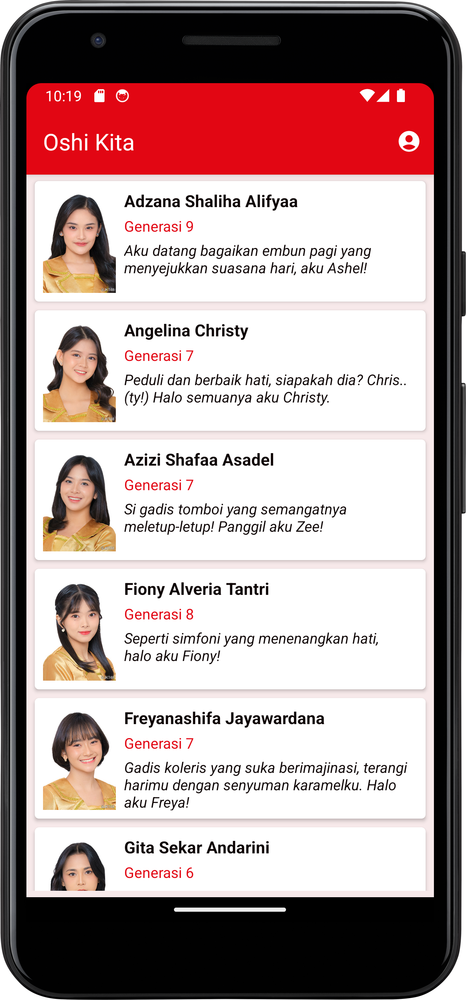
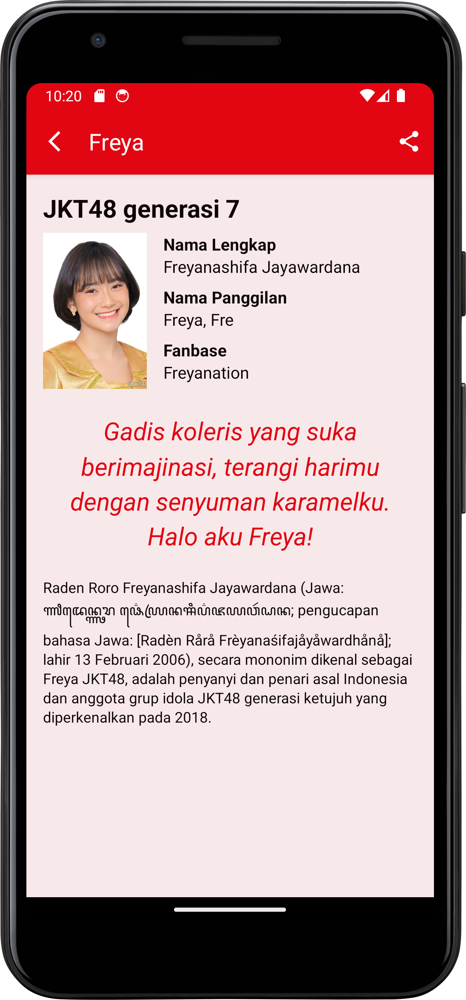
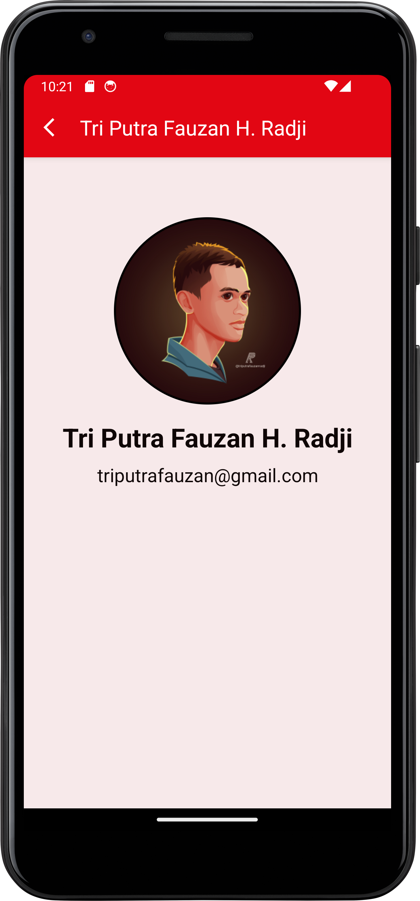

# Oshi Kita

**Oshi Kita** is a tribute Android application dedicated to JKT48. This application is built using Kotlin.

## Screenshots

Here are some screenshots of the app

  <figure>
    
    <figcaption style="text-align: center">MainActivity</figcaption>
  </figure>
  <figure>
    
    <figcaption style="text-align: center">DetailActivity</figcaption>
  </figure>
  <figure>
    
    <figcaption style="text-align: center">AboutActivity</figcaption>
  </figure>

## Features

- :white_check_mark: List of JKT48 member
- :white_check_mark: Detail of JKT48 member
- :white_check_mark: About page
